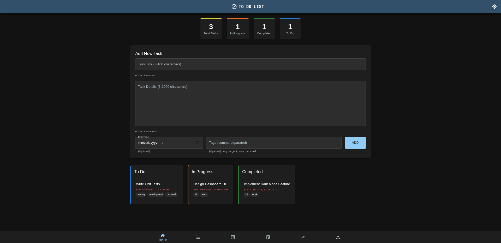
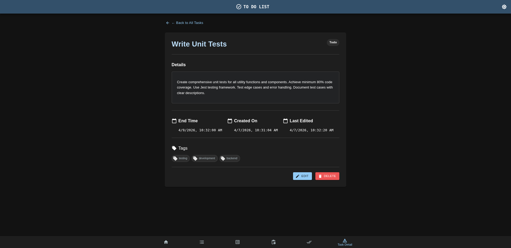
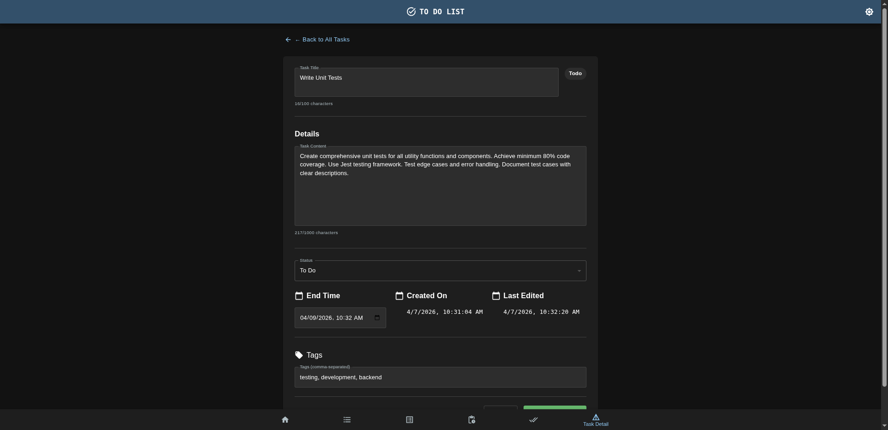
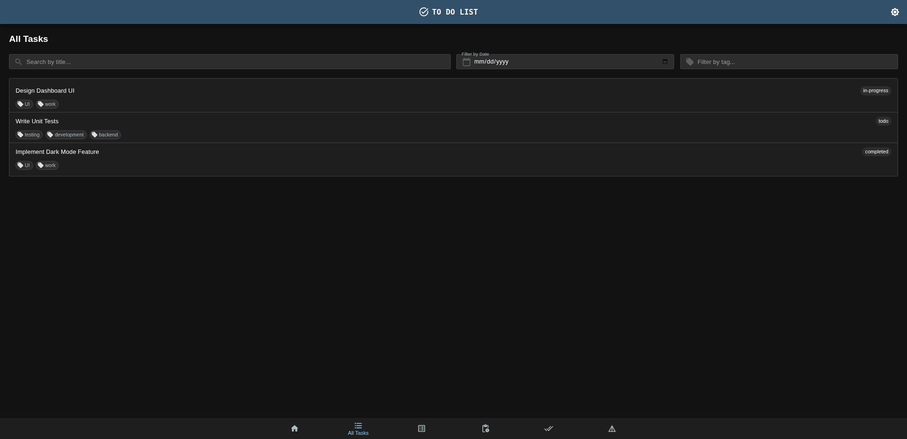
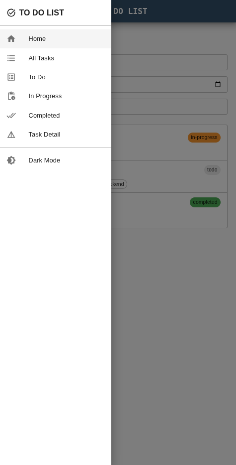

# To-Do List Application - Complete Feature Documentation

A modern, fully-featured React to-do list application built with Material-UI, featuring task management, dark mode support, responsive design, and comprehensive filtering capabilities.

---

## Application Overview







---

## Core Features

### 1. Task Management
- Create Tasks: Add new tasks with title, content, end time, and tags
- Edit Tasks: Modify existing task details including status, content, and metadata
- Delete Tasks: Remove tasks with confirmation dialog
- Task Status: Three status levels - To Do, In Progress, Completed
- Tags: Add comma-separated tags to organize tasks
- Detailed Content: Support for long-form task descriptions (up to 1000 characters)

### 2. Task Filtering and Searching
- Title Search: Search tasks by title (case-insensitive)
- Date Filtering: Filter tasks by end time
- Tag Filtering: Find tasks by specific tags
- Status Sorting: Tasks automatically sorted by priority:
  - In Progress (highest priority)
  - To Do (medium priority)
  - Completed (lowest priority)

### 3. Task Views

#### Dashboard (Home)
- Statistics Section: Display totals for all tasks, in-progress, completed, and to-do
- Quick Add Form: Add new tasks directly from dashboard
- Recent Tasks: Shows 3 most recent tasks per status category

#### All Tasks View
- Complete Task List: View all tasks with advanced filtering
- Multi-Field Search: Simultaneously filter by title, date, and tags
- Task Preview: Shows title (2-line preview), status, date, and tags for each task
- Real-time Filtering: Instant search results as you type

#### Task Categories (To Do / In Progress / Completed)
- Status-Based Views: Separate views for each task status
- Task Details: Shows title, end time, and tags for each task in category
- Organized Display: Scrollable list with 300px max height

#### Task Detail Page
- Full Task Information:
  - Complete title and content display
  - Current status with visual indicator
  - End time (if set)
  - Creation timestamp
  - Last edited timestamp (if edited)
  - Associated tags with icons
- Inline Editing: 
  - Edit mode toggles for all fields
  - Real-time validation with error messages
  - Character counters for title (100 chars max) and content (1000 chars max)
  - Orange-bordered input fields with focus effects in edit mode
- Visual Design:
  - Color-coded status chips
  - Professional card-based layout
  - Responsive grid layout for tablet/desktop

### 4. Form Validation

#### Title Validation
- Required field
- Minimum 3 characters
- Maximum 100 characters
- Auto-clearing error messages
- Character counter

#### Content Validation
- Required field
- Minimum 3 characters
- Maximum 1000 characters
- Auto-clearing error messages
- Character counter

#### End Time Validation
- Optional field
- Cannot be set to past date/time
- Real-time validation feedback

#### Tags Validation
- Optional field
- Maximum 50 characters per tag
- Comma-separated format
- Auto-trimming of whitespace

### 5. Data Persistence

- Task Persistence: All tasks automatically saved to browser localStorage (todo_tasks key)
- Theme Preference: Dark mode preference persisted across sessions (darkMode key)
- Automatic Sync: Data syncs whenever tasks are added, updated, or deleted
- Session Resilience: Tasks and preferences restored on page reload

### 6. Time Management

- Creation Time: Automatically set when task is created
- Last Edited Time: Automatically updated whenever task is saved
- End Time: User-specified deadline
- Time Format: M/D/YYYY, HH:MM:SS AM/PM

### 7. Dark Mode Support

- Toggle Feature: Easy switching between light and dark modes
- Persistent Preference: Dark mode selection saved to localStorage
- Light Theme: Primary #324f6b, Secondary #f57c00, Background #fafafa
- Dark Theme: Primary #90caf9, Secondary #ffb74d, Background #121212

### 8. Navigation and Layout

- Mobile Navigation: Hamburger menu, drawer navigation, hidden bottom nav
- Desktop Navigation: Bottom navigation bar with 6 tabs, dark mode toggle
- 6 Navigation Tabs: Home, All Tasks, Task Detail, To Do, In Progress, Completed

### 9. User Experience

- Success Alerts: Green messages with 3-second auto-dismiss
- Delete Confirmation: Modal dialog
- Hover Effects: 0.3s transitions
- Keyboard Support: Enter key submits forms

### 10. Material-UI Components
Box, Paper, Typography, Button, TextField, Chip, Grid, Dialog, Select, MenuItem, FormControl, InputLabel, Divider, Alert, List, ListItem, ListItemText, AppBar, Drawer

---

## Technical Stack

| Technology | Purpose |
|-----------|---------|
| React 18 | Frontend framework |
| Material-UI v5+ | Component library and theming |
| localStorage API | Data persistence |

---

## Project Structure

```
src/
├── App.jsx
├── theme.js
├── components/
│   ├── Header.jsx
│   ├── BottomNav.jsx
│   ├── AppContent.jsx
│   ├── Dashboard.jsx
│   ├── AddTaskForm.jsx
│   ├── AllTasks.jsx
│   ├── TaskList.jsx
│   ├── TaskDetailApp.jsx
│   ├── StatsSection.jsx
│   └── TaskSection.jsx
└── index.html
```

---

## Getting Started

### Installation
```bash
npm install
```

### Development
```bash
npm run dev
```

### Build
```bash
npm run build
```

---

## Task Data Structure

```javascript
{
  id: "uuid-string",
  creationTime: "ISO-8601-timestamp",
  lastEditedTime: "ISO-8601-timestamp",
  title: "Task Title",                   // 3-100 chars
  status: "todo|in-progress|completed",
  content: "Detailed description",       // 3-1000 chars
  endTime: "ISO-8601-timestamp|null",
  tags: ["tag1", "tag2"]
}
```

---

## Validation Rules

- Title: Required, 3-100 characters
- Content: Required, 3-1000 characters
- End Time: Optional, cannot be in past
- Tags: Optional, max 50 characters per tag

---

## Local Storage Keys

- `todo_tasks`: All task objects as JSON array
- `darkMode`: Boolean for dark mode preference

---

## Version and Status

Version: 1.0.0
Last Updated: April 7, 2026
Status: Production Ready
